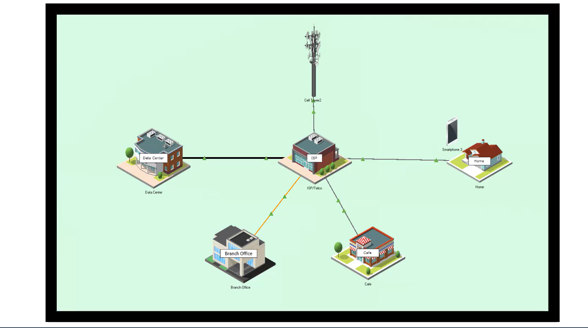
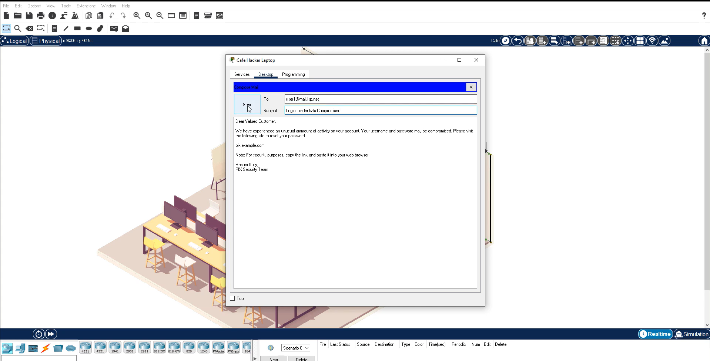
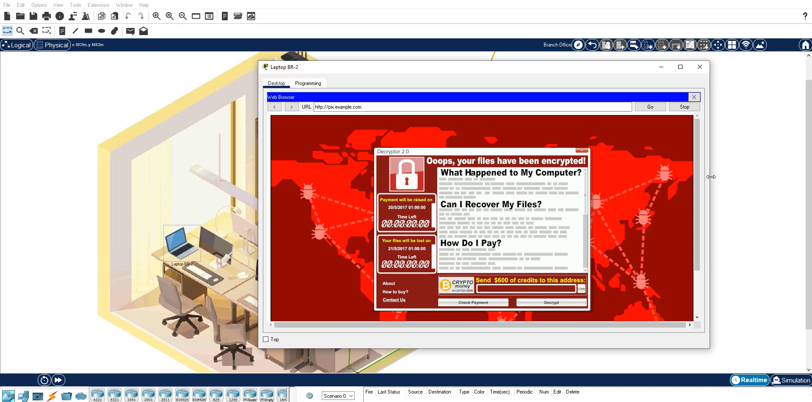
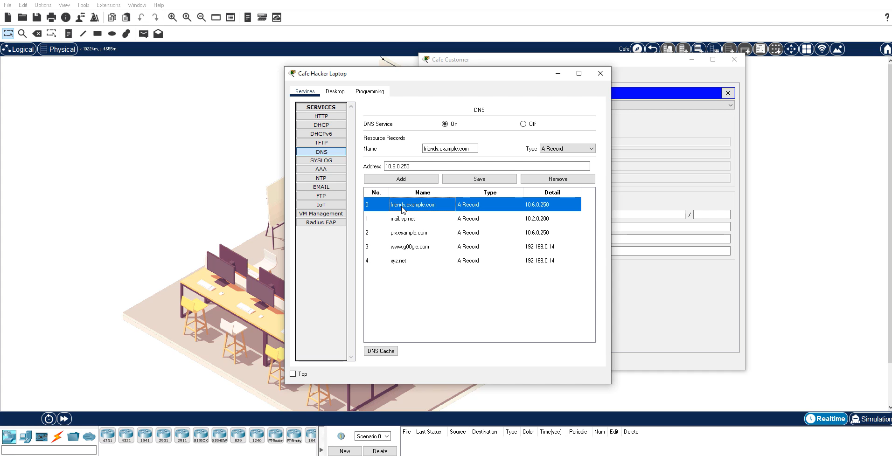

# Investigating a Threat Landscape in Cisco Packet Tracer

## Overview

This lab uses a Cisco Packet Tracer simulation to examine how small configuration
weaknesses and user actions can develop into broader security incidents. The
activity covers a home network, a cafe wireless network, a branch office, an ISP,
and supporting services in a data center.

## Scope and Safety

- **Environment:** Cisco Packet Tracer simulation
- **Targets:** Simulated devices contained in the activity file
- **External systems:** None
- **Purpose:** Cybersecurity coursework and defensive learning

No traffic was sent to a real network.

## Learning Objectives

- Identify insecure router and wireless settings.
- Trace a simulated phishing-to-ransomware scenario.
- Recognize the risk of a rogue access point using a familiar SSID.
- Understand how DHCP and DNS manipulation can redirect client traffic.
- Translate each scenario into practical defensive controls.

## Scenario Analysis

| Scenario | Observation | Defensive takeaway |
| --- | --- | --- |
| Home router configuration | The simulated router exposes settings that can weaken access control and network separation. | Replace default credentials, use strong encryption, update firmware, disable unnecessary administration paths, and isolate guest devices. |
| Phishing and ransomware | A simulated security-themed message directs a user to an untrusted site, followed by a ransomware-style outcome. | Use email filtering, security awareness, endpoint protection, tested backups, and an incident-response process. |
| Rogue wireless access | Multiple access points advertise the same network name, making visual identification unreliable. | Prefer authenticated enterprise wireless, validate the network before connecting, and monitor for unauthorized access points. |
| DHCP and DNS manipulation | A rogue service supplies network settings and DNS records that can redirect clients. | Control DHCP at the network edge, protect trusted DNS resolvers, segment untrusted clients, and alert on unexpected configuration changes. |

## Evidence

- [Completed Packet Tracer activity](Investigate%20a%20Threat%20Landscape.pka)
- [Full screenshot set](Screenshots)

| Network overview | Simulated phishing message |
| --- | --- |
|  |  |

| Simulated ransomware outcome | Rogue DNS configuration |
| --- | --- |
|  |  |

Additional captures document the router administration prompt, email receipt,
duplicate wireless network names, DHCP settings, and endpoint network
configuration.

## Defensive Lessons

1. A single weak control can become the first step in a longer attack path.
2. Familiar network names and convincing messages are not proof of trust.
3. Guest and unmanaged devices should not share unrestricted access with internal
   assets.
4. DHCP and DNS deserve the same monitoring attention as endpoint activity.
5. Backups, segmentation, endpoint controls, and user awareness are complementary
   layers rather than substitutes for one another.

## Limitations

- Packet Tracer models the scenarios; it does not reproduce every behavior of a
  production network or real malware.
- The repository contains screenshots rather than exported packets or event logs.
- The activity demonstrates concepts but does not measure detection coverage or
  incident-response time.

## Skills Practiced

- Cisco Packet Tracer
- Network and wireless security
- Threat-path analysis
- DHCP and DNS security
- Phishing and ransomware awareness
- Defensive control selection
