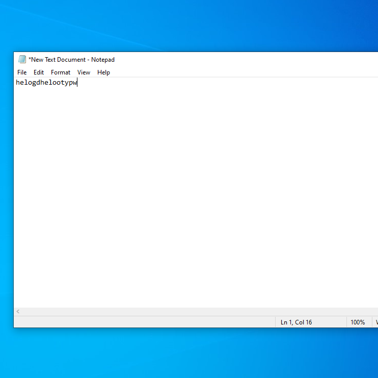
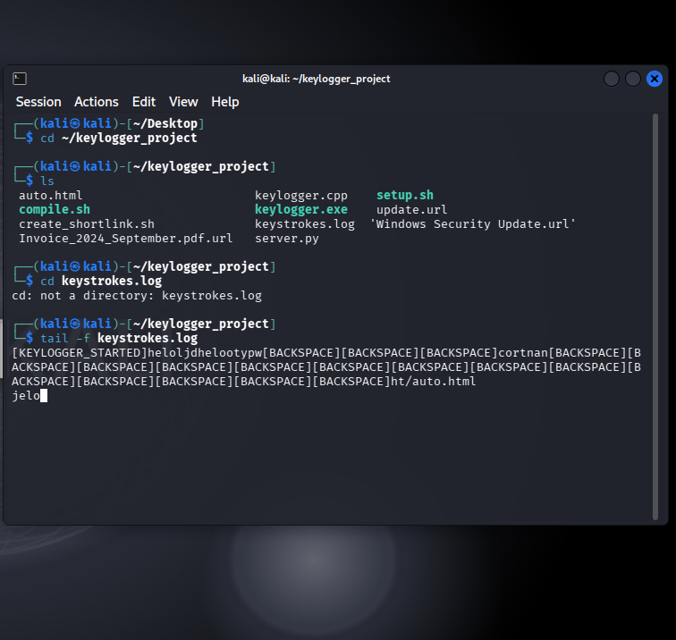

# Keylogging Risk Demonstration in an Isolated Lab

## Overview

This lab demonstrates why keystroke-capture behavior is a serious endpoint risk.
Synthetic text entered in a Windows 10 virtual machine was observed from a Kali
Linux virtual machine inside an isolated environment.

The repository documents the outcome without distributing the keylogger source,
an executable payload, or deployment instructions.

## Scope and Safety

| Component | Details |
| --- | --- |
| Analysis VM | Kali Linux |
| Test endpoint | Windows 10 |
| Network | Isolated virtual network |
| Input | Synthetic lab text only |
| Real users or systems | None |

## Objectives

- Understand the confidentiality impact of keystroke capture.
- Observe how captured input can cross a network boundary.
- Identify endpoint and network controls relevant to this behavior.
- Practice documenting dual-use security work responsibly.

## High-Level Method

1. Prepare two isolated virtual machines and verify lab-only connectivity.
2. Run the proof of concept on the Windows test endpoint.
3. Enter non-sensitive sample text in the endpoint's text editor.
4. Observe the resulting lab record from the Kali VM.
5. Stop the exercise and retain only sanitized screenshots.

## Evidence

| Test input | Captured lab output |
| --- | --- |
|  |  |

The screenshots show the relationship between synthetic endpoint input and the
recorded keystroke stream, including editing keys such as Backspace.

## Defensive Takeaways

- Use application allowlisting and endpoint protection to limit unapproved
  executables.
- Monitor suspicious process creation, persistence changes, input-hook behavior,
  and unexpected outbound connections.
- Apply least privilege so ordinary users cannot freely install or execute
  untrusted software.
- Treat unexpected attachments, shortcuts, and software-update prompts as
  potential social-engineering signals.
- Rotate exposed credentials from a known-clean device if keylogging is suspected.

## Limitations

- The evidence demonstrates a controlled proof of concept, not evasion of a modern
  endpoint detection product.
- No endpoint telemetry, packet capture, or detection alert is included.
- The screenshots do not establish persistence, privilege escalation, or behavior
  outside the isolated lab.

## Skills Practiced

- Virtual-machine isolation
- Endpoint-risk analysis
- Basic client/server communication
- Evidence sanitization
- Defensive control selection
