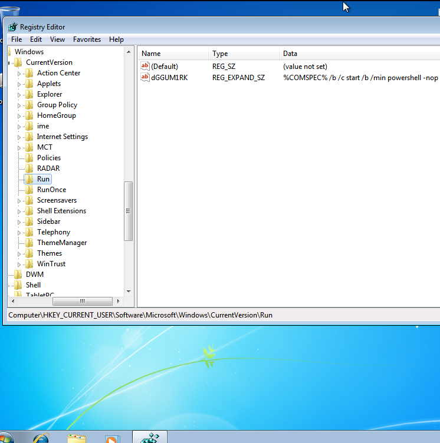
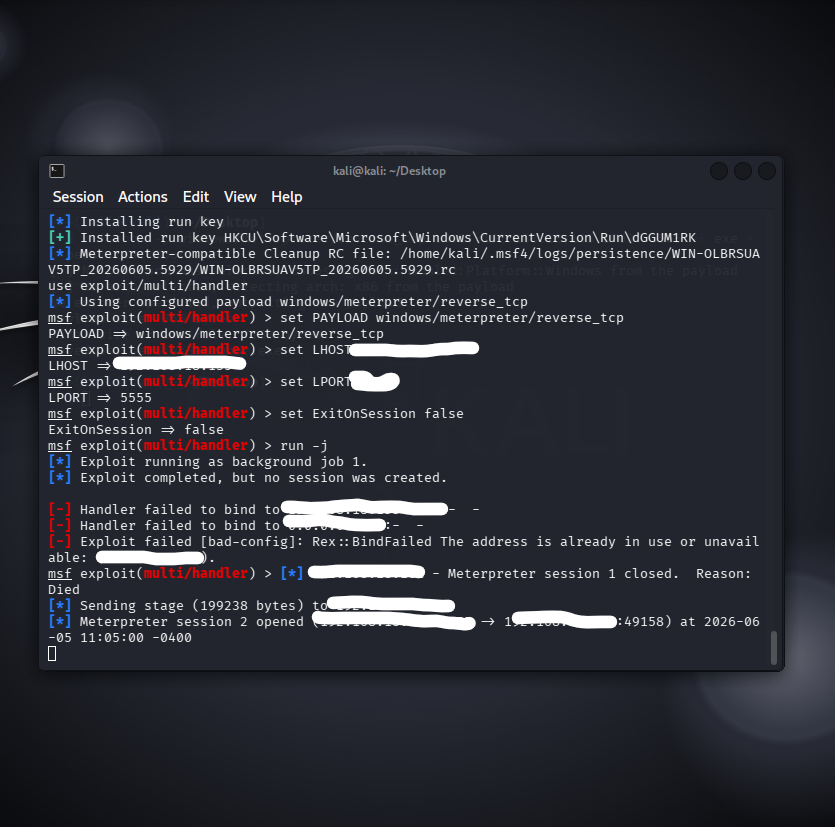

# Windows Persistence and Detection Lab

## Overview

This controlled lab examines how an autostart entry can preserve unwanted behavior
across user logons and why defenders monitor persistence locations. A Windows 7
virtual machine was used as the legacy test endpoint, with Kali Linux as the
analysis system.

## Scope and Safety

| Component | Details |
| --- | --- |
| Host | Windows 11 |
| Analysis VM | Kali Linux |
| Test endpoint | Windows 7 |
| Virtualization | VMware Workstation |
| Network | Isolated virtual network |

The exercise was limited to author-owned virtual machines. Screenshots redact the
lab addresses, and this repository does not include a payload or setup commands.

## Objectives

- Recognize a common Windows autostart location.
- Understand the security impact of unauthorized persistence.
- Identify endpoint telemetry that could reveal a persistence change.
- Relate legacy-system risk to patching and lifecycle management.

## Evidence

| Autostart artifact | Controlled lab session |
| --- | --- |
|  |  |

The registry screenshot records a value under the current user's `Run` key. The
terminal screenshot records the corresponding controlled lab context; network
identifiers have been removed.

## Key Observations

- User-level autostart locations can launch a configured command at logon.
- A persistence artifact is valuable evidence even when the associated process is
  no longer running.
- Legacy operating systems carry additional risk because current security fixes
  and platform protections may be unavailable.
- Persistence investigation should connect registry changes with process,
  authentication, and network telemetry.

## Defensive Takeaways

- Monitor user and machine autostart locations for unexpected changes.
- Record process ancestry and command-line activity on endpoints.
- Apply application control, least privilege, and outbound network restrictions.
- Review scheduled tasks, services, startup folders, and other persistence surfaces
  during an investigation.
- Isolate and rebuild a system when trust cannot be restored confidently.

## Limitations

- Windows 7 is obsolete and does not represent the protections of a supported
  Windows release.
- No Windows event logs, endpoint alerts, or packet captures are included.
- The evidence demonstrates the lab artifact and session context, not long-term
  stealth or bypass of a security product.

## Skills Practiced

- Windows Registry analysis
- Virtualization
- Persistence-artifact recognition
- Security monitoring concepts
- Evidence redaction
- Defense-in-depth reasoning
