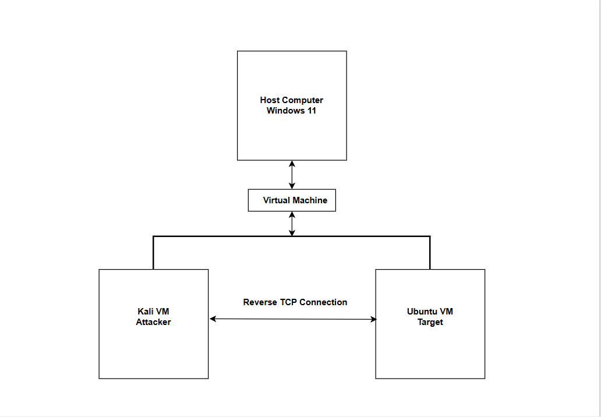
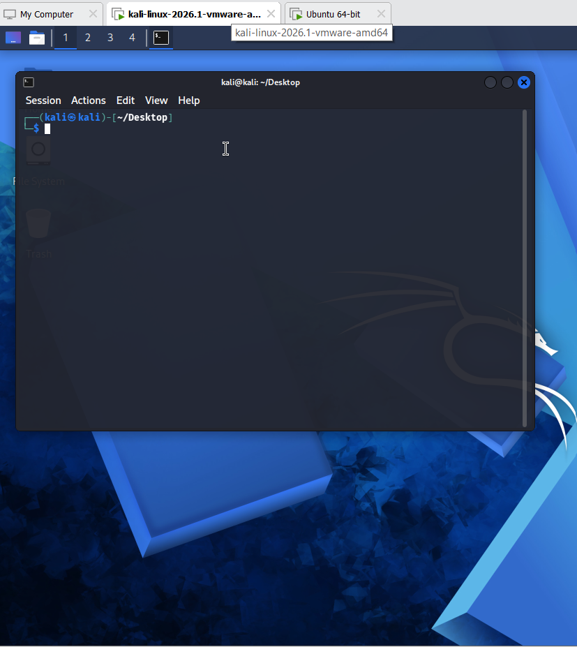
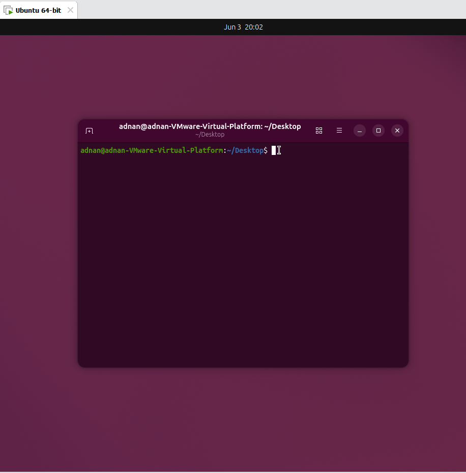

# Reverse TCP Communication Lab

## Overview

This lab explores the security implications of a host initiating an outbound TCP
connection to another system. The focus is the network model, the reason reverse
connections can cross permissive egress boundaries, and the controls defenders can
use to detect or restrict unexpected communication.

## Scope and Safety

| Component | Details |
| --- | --- |
| Host | Windows 11 |
| Virtualization | VMware Workstation |
| Analysis VM | Kali Linux |
| Test endpoint | Ubuntu Linux |
| Network | Isolated virtual network |

No public host or third-party system was involved.

## Objectives

- Understand the direction of a reverse TCP connection.
- Review connectivity requirements between two virtual machines.
- Explain why outbound filtering matters.
- Identify useful endpoint and network evidence for an investigation.

## Lab Model

In this model, the test endpoint initiates the connection toward a waiting analysis
system. The resulting TCP session is bidirectional, but its initial outbound
direction can matter when a network allows broad egress traffic.

## Documented Environment

| Kali Linux VM | Ubuntu Linux VM |
| --- | --- |
|  |  |

## Defensive Takeaways

- Restrict outbound traffic to required destinations, ports, and applications.
- Correlate new network connections with the process that created them.
- Alert on unusual long-lived sessions, rare destinations, and unexpected parent
  processes.
- Use application control, endpoint monitoring, and segmentation to reduce the
  impact of untrusted files.
- Preserve flow records or packet captures when connection timing and direction are
  important to an investigation.

## Evidence Limitations

The current images document the topology and the two lab endpoints, but they do not
show a completed TCP session, listener output, packet capture, or detection alert.
Accordingly, this write-up does not claim that a connection was successfully
established.

A stronger future revision should include:

- A sanitized packet capture or flow summary
- Listener and client timestamps
- The originating process on the test endpoint
- A clearly defined expected alert or blocking rule
- A short result section comparing the expected and observed behavior

## Skills Practiced

- TCP connection-direction reasoning
- Virtual-machine networking
- Network egress-control concepts
- Defensive monitoring design
- Evidence-quality assessment
